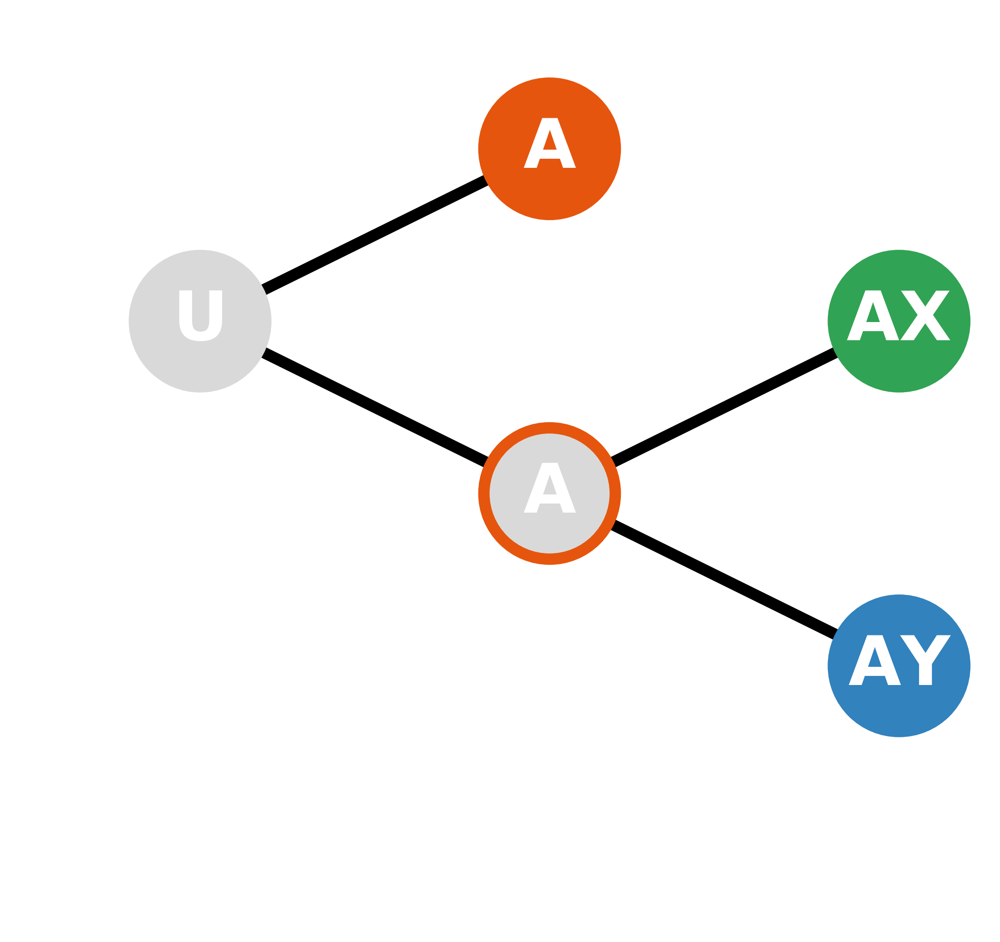
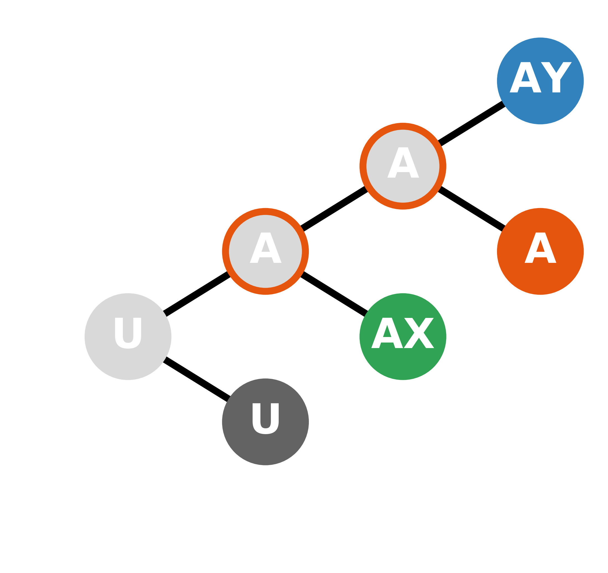

# SCG (Semi-Conservative Genealogy tree reconstruction)

-----------------

## MOTIVATION

Somatic mutations can be used for cell lineage tree reconstruction.
Util now, several hypermutation system has been adpoted,
and a ideal mutation system should be division-coupled,
which at the same time wiil cause some problems.
Cause **semi-conservative DNA replication**, division-coupled mutation are heterogeneous.
I means the new mutation only be pass on to one descendant cell,
while another cell remain unchanged.

Current phylogenetic tree methods are developed for long term evolution,
in which mutation the space is far greater than the number of leaf,
and evolution time is long enough for the internal nodes to dropout. 
In cell genealogy tree, the number of cell are tremendous,
and the mutation accumulate in semi-conservative way.

   

semi-conservative genealogy aware algorithm (on the right)
